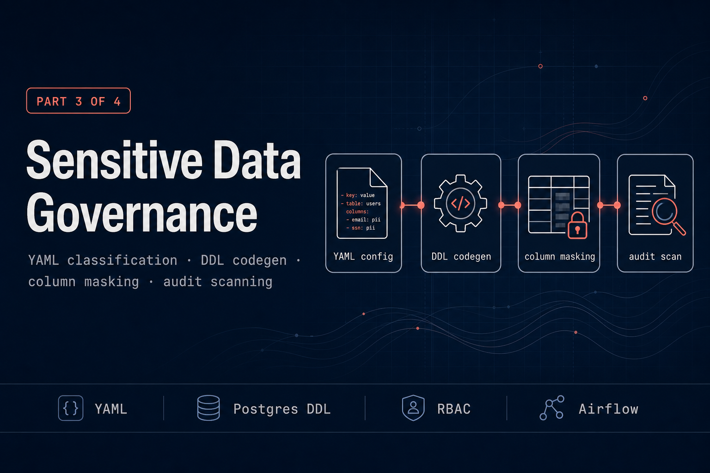

# workforce-intelligence-platform-governance — sensitive data governance layer

Part 3 of 4 in the [workforce-intelligence-platform](../README.md).

YAML-driven, code-generated data governance: sensitivity classification, column masking, access control DDL, and audit scanning for all People Analytics data. (Part 3 of 4)

---

## What this accomplishes

### The problem

People Analytics data is among the most sensitive data any company holds — salaries,
performance ratings, terminations, names, emails. The access rules around it are real and
specific (*"only HR Partners and Legal may read salary"*), but in most systems those rules
live in a Confluence page nobody updates or a one-off SQL script someone ran two years ago.
Neither tells you what the database is **actually** enforcing today, and both drift silently
from reality.

This module makes the policy **executable**. One YAML file is the single source of truth for
every column's sensitivity, and Python codegen turns it into the Postgres objects that
enforce it — so the documentation and the database physically cannot disagree.

### What it delivers

- **Classification as code** — every column in every analytics/LLM table is tagged
  `public` / `internal` / `confidential` / `restricted` in one Pydantic-validated YAML file.
- **Generated access control** — `GRANT` / `REVOKE` DDL that gives each role exactly the
  columns it's allowed, with restricted columns (salary, performance) revoked from the base
  table entirely.
- **Masking views** — analyst-facing views that mask confidential PII (`full_name → '***'`,
  `manager_id → MD5(...)`) and drop restricted columns, so even a `SELECT *` cannot leak them.
- **Audit scanning** — a weekly Airflow DAG scans `pg_stat_statements` for access to
  restricted columns by roles that shouldn't have it, and reports findings.
- **A human-reviewed access matrix** — the policy decisions (who, what, *why*) signed off by
  Legal/HR, kept deliberately hand-written next to the generated artifacts.

### Why it matters

Governance-as-code gives you three things a wiki never can:

| Property | What it means | How this module provides it |
|---|---|---|
| **Auditability** | The policy is readable and reviewable | One version-controlled YAML file + a reviewable generated `git diff` |
| **Enforceability** | The policy is actually applied | DDL the database runs — grants, revokes, masking views |
| **Observability** | You can tell whether it's being followed | A weekly scan of real query history → findings report |

Reclassify a column from `internal` to `restricted`, run one command, and the grants, the
masked views, and the audit registry all update together. There is no second place to forget.

### Use cases & impact

- **Onboarding an analyst** — grant the `analyst_reader` role and they immediately see masked
  views and never the raw salary column, *by construction* rather than by policy goodwill.
- **Reclassifying a column** — Legal decides `manager_id` is now confidential; one YAML edit,
  one `make apply-ddl`, and the change is enforced and recorded everywhere at once.
- **Keeping LLMs safe** — only `public` / `internal` columns are LLM-eligible, so the
  embedding/RAG pipeline (module 2) can't accidentally vectorize salary or performance data.
- **Compliance sign-off** — a reviewer reads the access matrix and the YAML, not 30 scattered
  SQL files, to confirm what the platform enforces.
- **Catching drift** — the weekly DAG surfaces the day someone over-grants a role or queries a
  restricted column they shouldn't have touched.

---

## Architecture

```
 policies/data_classification.yml
         │
         ▼
  src/classifier/loader.py        ← validates config with Pydantic
         │
         ├──────────────────────────────────────────────────┐
         ▼                                                   ▼
  src/codegen/ddl_generator.py              src/codegen/view_generator.py
  GRANT / REVOKE / SECURITY LABEL           CREATE OR REPLACE VIEW
         │                                           │
         └────────────────┬──────────────────────────┘
                          ▼
               Applied to Postgres (analytics.*, llm.*)
                          │
                          ▼
             src/audit/scanner.py
             scans pg_stat_statements weekly
                          │
                          ▼
              governance.access_audit_log
                          │
                          ▼
          Airflow DAG: governance_audit (Sunday 3am)
```

---

## Tech stack

| Concern | Technology |
|---|---|
| Config format | YAML (Pydantic-validated) |
| DDL codegen | Python |
| Audit scanning | pg_stat_statements + Python |
| Orchestration | Apache Airflow 2.9 |
| Testing | pytest |

---

## Setup

### Prerequisites

This module applies governance DDL on top of the shared data layer, so it expects:

1. **Postgres is running** — `make infra-up` from the platform root.
2. **Ingestion has been set up** — `make ingestion-setup` creates the base login roles
   (`analyst_reader`, `dbt_transformer`, `ingestion_writer`), and `make ingestion-dbt`
   builds the `analytics.*` / `llm.*` tables that the grants and views reference.

The DB connection is read from `DATABASE_URL`, falling back to `POSTGRES_HOST` /
`POSTGRES_PORT` / `POSTGRES_USER` / `POSTGRES_PASSWORD` / `POSTGRES_DB` (the same env the
ingestion module uses). Export them — or source the platform-root `.env` — before applying.

### Apply

```bash
cd 3-governance
make setup    # install -> bootstrap-roles -> generate-ddl -> apply-ddl
```

`make setup` runs four steps:

| Step | What it does |
|---|---|
| `install` | `pip install -e ".[dev]"` |
| `bootstrap-roles` | Creates the governance-owned roles `hr_partner_role` + `legal_role` (idempotent). The base roles come from ingestion; these two are introduced by the access policy, so governance owns them. |
| `generate-ddl` | Reads `policies/data_classification.yml` and writes SQL artifacts to `generated/` (no DB needed). |
| `apply-ddl` | Applies `audit_setup.sql`, `access_control.sql`, and `masking_views.sql` with `ON_ERROR_STOP=1`, so a failed statement fails the target instead of being silently swallowed. |

Run `make help` for the full target list.

### Column-level SECURITY LABELs (optional)

`generate-ddl` also writes `generated/security_labels.sql`, which tags PII columns for the
[PostgreSQL Anonymizer](https://postgresql-anonymizer.readthedocs.io/) (`anon`) extension.
That extension is **not** part of the shared `pgvector/pgvector:pg16` image, so the labels
are kept out of `apply-ddl` (which must stay green on a stock database). To apply them:

```bash
# once, on a Postgres image that ships the anon extension:
psql "$DATABASE_URL" -c "CREATE EXTENSION anon;"
make apply-security-labels
```

---

## How to add a new sensitive column

1. Edit `policies/data_classification.yml` — add the column under its table with
   the appropriate `sensitivity` level, `pii` flag, and `mask_with` expression
2. Run `make generate-ddl` — this regenerates the SQL scripts
3. Review the generated SQL in `generated/` before applying
4. Run `make apply-ddl` — applies the new grants and views to Postgres
5. Run `make test` to verify the new column is handled correctly

---

## Design decisions

**Code-generated governance over manual SQL.** Classification is defined once in YAML
and propagates automatically to grants, views, and audit config. When a column is reclassified
from `internal` to `restricted`, one YAML edit and one `make apply-ddl` updates everything.
Manual SQL maintenance diverges over time and requires reviewing every file on every change.

**pg_stat_statements scanner over column-level triggers.** Postgres does not support
column-level SELECT triggers natively. The honest, production-realistic approach is a
scheduled scanner against `pg_stat_statements` that checks query text for restricted column
names and flags unexpected roles. This is how `pg_audit` works in principle. The trade-off —
scanning query text is fuzzy, not guaranteed — is documented in the access matrix.

**Human-written access matrix.** The `data_access_matrix.md` is authored by the data platform
team and reviewed by Legal and HR. It cannot be generated because it encodes policy decisions
(who should have what access, why) not just technical facts. A generated document signals
that no human reviewed the policy — a red flag for compliance teams.

**SECURITY LABELs are an optional, separate artifact.** The `anon` SECURITY LABELs depend on
the PostgreSQL Anonymizer extension, which the shared Postgres image does not ship. Folding
them into the core access-control script would make `apply-ddl` fail on a stock database, so
they are generated into their own `security_labels.sql` and applied on demand. The functional
masking — column-level grants plus the masked views — does not depend on `anon`.

---

## Build vs. buy

This is a solved problem commercially — data governance is a mature, crowded market, and a
real company would almost certainly buy rather than build. The landscape, by category:

- **Data-access / policy enforcement** — [Immuta](https://www.immuta.com/),
  [Satori](https://satoricyber.com/), [Privacera](https://privacera.com/): dynamic masking,
  attribute-based access control, runtime query interception, and access auditing.
- **Discovery + privacy** — [BigID](https://bigid.com/), [OneTrust](https://www.onetrust.com/):
  ML-based PII discovery, data-subject-access requests, regulatory compliance workflows.
- **Catalogs + stewardship** — [Collibra](https://www.collibra.com/),
  [Alation](https://www.alation.com/), [Atlan](https://atlan.com/): classification workflows,
  lineage, and human approval flows.
- **Warehouse-native** — Snowflake dynamic masking + row-access policies + tags, Databricks
  Unity Catalog column masks / row filters: governance built into the platform you already pay for.
- **Open-source / Postgres-native** (closest to this module) — `pgAudit` (audit logging),
  PostgreSQL Anonymizer (masking), [Apache Ranger](https://ranger.apache.org/) (fine-grained
  access policies).

How this module compares to a typical commercial platform:

| Capability | This module | Typical commercial platform |
|---|---|---|
| Classification source of truth | YAML in git, Pydantic-validated | UI / catalog, often ML-discovered |
| PII discovery | Manual classification | Automated ML scanning |
| Policy enforcement | Generated `GRANT`/`REVOKE` + masking views (plain DDL the DB runs) | Runtime policy engine, attribute-based, query proxy |
| Masking | Static, view-based (`'***'`, `MD5(...)`, column drop) | Dynamic, role/attribute-aware, format-preserving |
| Access audit | Weekly `pg_stat_statements` scan (fuzzy text match) | Real-time interception, tamper-evident logs |
| Compliance reporting | Hand-written access matrix | Certified GDPR / CCPA / SOC 2 reports |
| Cost / footprint | $0, runs on the existing Postgres | 5–6-figure licensing, often needs a cloud warehouse |
| Transparency / lock-in | Every rule readable + diffable in git; none | Policies live in the vendor control plane |

**Why this module is hand-built anyway.** The platform is a single self-hosted Postgres on a
$0 budget; an enterprise governance SaaS is disproportionate to it — the licensing alone dwarfs
the project, and most of these tools assume a cloud warehouse (Snowflake/Databricks) that this
stack doesn't run. More to the point, re-implementing the core ideas — classification-driven
policy, generated enforcement, masking, audit — demonstrates *how* governance actually works
under the hood, which is the point of a portfolio. Wiring up a vendor's console would hide
exactly the mechanics worth showing.

**What building it yourself does add.** A few properties fall out of the code-generated approach
that the managed tools trade away: **transparency** — every grant traces to a line of YAML, so a
reviewer reads the policy itself rather than a vendor dashboard; **git-native change review** —
the policy and the generated DDL are version-controlled and diffable, so a policy change *is* a
code review; and **zero cost / zero lock-in** — it runs on the Postgres already in the stack and
integrates natively with the platform's dbt + Airflow, with no separate control plane to operate.

**When you'd reach for a vendor instead — and that's the honest answer.** For a funded team with
a cloud warehouse, buying is the pragmatic call. Commercial platforms deliver things this layer
deliberately doesn't: battle-tested runtime enforcement via true query interception (not the
fuzzy log-scanning used here — the clearest gap, see [Known limitations](#known-limitations)
below), ML-based PII discovery, attribute-based policies, and certified compliance reporting.
This module is **not** a production replacement for Immuta, Satori, or Unity Catalog — it exists
to demonstrate the concepts end-to-end and to keep the portfolio free and lock-in-free. Swapping
in one of those tools is exactly what a real deployment with a budget should do.

---

## Known limitations

- **SECURITY LABELs require PostgreSQL Anonymizer.** Generated into `security_labels.sql` and
  applied via `make apply-security-labels`, not as part of `make setup`, because the shared
  `pgvector/pgvector:pg16` image does not include `anon`.
- **The audit scanner relies on `pg_stat_statements`.** Postgres only collects query history
  when the library is in `shared_preload_libraries`. The shared `docker-compose.yml` now
  preloads it (`command: postgres -c shared_preload_libraries=pg_stat_statements`), and
  `apply-ddl` runs `CREATE EXTENSION pg_stat_statements` to register the view. If you point the
  module at a different Postgres, set the same startup flag there or the weekly
  `governance_audit` DAG will have no statement history to scan.
